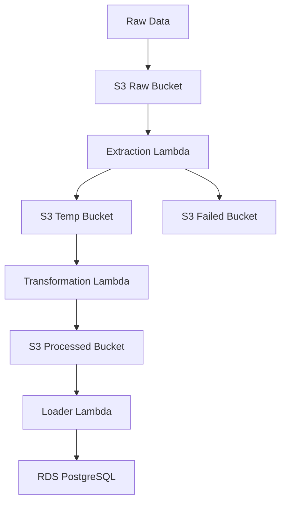

# Building a Scalable Serverless AWS ETL Pipeline with Lambda, S3, and RDS PostgreSQL

## Overview

When working on data-driven projects you often need to extract data from third-party sources, public APIs, or CSV files shared by other teams. However, before this data becomes useful, it typically requires cleaning, validation, and transformation before being loaded into a data warehouse for analytics, dashboards, machine learning, or any other use case you might have.

Knowing that, in this post, we’ll walk through the basics of building a simple but effective ETL pipeline using AWS Lambda, Amazon S3, and Amazon RDS PostgreSQL. This post is not about creating the perfect and most optimized ETL solution but rather about demonstrating how AWS services can be used together to automate data processing in a straightforward way. By the end of this guide, you’ll understand how to trigger a Lambda function to process data and store structured outputs in S3 for further analysis.

## What will we build?

For our example pipeline, we will take a JSON file containing recipe information, validate the data and extract the necessary information, transform the extracted data into clean and query-ready data and finally load it into a PostgreSQL database where it will be ready to be used for any use case you might have.

## Architecture Diagram



## What will we use and why?

- AWS Lambda: We will use Lambda Functions to do the heavy lifting of extracting, transforming and loading the data. We chose Lambda specially for the serverless nature of the service, this way we don't need to worry about the underlying infrastructure and can focus on the code we want to execute. It also helps us that Lambdas are event-driven, so we can trigger the function from a variety of sources, like S3 events, API Gateway, or even a cron job. This resource is also very cheap to run, adopting a pay-per-use model.

- Amazon S3: We will use S3 to store the raw data, the temporary data, and the processed data. S3 is a very cheap and flexible object storage service that is well integrated with the rest of the AWS ecosystem. S3 also has a feature called S3 Event Notifications, that allows us to trigger a Lambda function when an object is created in a bucket. This is very useful for our use case, as we can trigger the Lambda function whenever a new file is uploaded to the S3 bucket.

- Amazon RDS PostgreSQL: RDS is a managed PostgreSQL database service that simplifies querying through standard SQL while maintaining good performance for frequent access patterns. RDS is also a managed service, which handles backups, updates, and other maintenance tasks, this way we can focus on the code we want to execute. Other viable options would be to use Amazon Aurora or Amazon Redshift, or even Redshift Spectrum if you want to build a solid data warehouse, but for this use case I felt that setting up Amazon Glue or any other metadata store would be overkill.

- AWS SAM: SAM is a tool that allows us to define AWS resources in a declarative way. Here we will use it to create the necessary resources for our pipeline.

## Let's get started

### Prerequisites

- AWS Account (I will be using the free tier)
- AWS CLI
- Python 3.x
- AWS SAM CLI

### The template

The SAM template is the main file that defines the resources for our pipeline. It's a YAML file that describes the AWS resources and their properties. To start, we will create the structure of the template.

```yaml
AWSTemplateFormatVersion: "2010-09-09"
Description: ETL Pipeline for Recipe Processing
Transform: AWS::Serverless-2016-10-31

Parameters:
  Environment:
    Type: String
    Default: dev

  RDSPostgreSQLHost:
    Type: String
    Default: localhost

  RDSPostgreSQLPort:
    Type: Number
    Default: 5432

  RDSPostgreSQLDBName:
    Type: String
    Default: postgres

  RDSPostgreSQLUsername:
    Type: String
    Default: postgres

  RDSPostgreSQLPassword:
    Type: String
    Default: postgres

  RDSPostgreSQLSchema:
    Type: String
    Default: public

  RDSPostgreSQLTable:
    Type: String
    Default: recipes

  RDSPostgreSQLParameterGroup:
    Type: String
    Default: postgres16

Resources: ...
```

This is a good starting point, it defines the environment variable that we will use to deploy the template to different environments, but it's still empty. We need to add the resources here for it to be useful.

### Step 1: Creating the necessary IAM roles

First, we need to create a Lambda execution role that will allow the Lambda functions to access the necessary resources.

```yaml
Resources:
  ...

  LambdaExecutionRole:
    Type: AWS::IAM::Role
    Properties:
      AssumeRolePolicyDocument:
        Version: "2012-10-17"
        Statement:
          - Effect: Allow
            Principal:
              Service: lambda.amazonaws.com
            Action: sts:AssumeRole
      Policies:
        - PolicyName: LambdaExecutionPolicy
          PolicyDocument:
            Version: "2012-10-17"
            Statement:
              - Effect: Allow
                Action:
                  - s3:GetObject
                  - s3:PutObject
                  - s3:ListBucket
                  - logs:CreateLogGroup
                  - logs:CreateLogStream
                  - logs:PutLogEvents
                Resource:
                  - !Ref RawRecipesBucket
                  - !Ref TempRecipesBucket
                  - !Ref FailedRecipesBucket
                  - !Ref ProcessedRecipesBucket
```

In this step we are defining the policy that will allow the Lambda functions to access the necessary resources. We are allowing the Lambda functions to get, put, and list objects in the S3 buckets as well as to create log groups and log streams in CloudWatch.

### Step 2: Create the S3 buckets

Now that we have the necessary IAM roles, we can create the S3 buckets that will store the raw data, the temporary data, the failed data, and the processed data.

```yaml
Resources:
  ... 

  RawRecipesBucket:
    Type: AWS::S3::Bucket
    Properties:
      BucketName: !Sub "raw-recipes-data-${Environment}"
      AccessControl: Private

  TempRecipesBucket:
    Type: AWS::S3::Bucket
    Properties:
      BucketName: !Sub "temp-recipes-bucket-${Environment}"
      AccessControl: Private

  FailedRecipesBucket:
    Type: AWS::S3::Bucket
    Properties:
      BucketName: !Sub "failed-recipes-bucket-${Environment}"
      AccessControl: Private

  ProcessedRecipesBucket:
    Type: AWS::S3::Bucket
    Properties:
      BucketName: !Sub "processed-recipes-bucket-${Environment}"
      AccessControl: Private
```

Here we define the 4 buckets that we will use in our pipeline. We will use the `!Sub` intrinsic function to dynamically create the bucket names using the `Environment` parameter defined in the `Parameters` section. Also, we set the `AccessControl` property to `Private`, so no one can access the buckets without the proper permissions.

### Step 3: Create the Lambda functions

With the buckets and IAM roles created we can proceed and create our Lambda functions. In this case we will create 3 Lambda functions:

- `extraction-lambda`: Where we will extract the data from the raw data
- `transformation-lambda`: Where we will transform the data
- `loader-lambda`: Where we will load the data into the RDS PostgreSQL database

```yaml
...
Resources:
  ... # Our recently created buckets

  DataExtractionLambda:
    Type: AWS::Serverless::Function
    Properties:
      FunctionName: !Sub "extraction-lambda-${Environment}"
      Handler: data_extraction.lambda_handler
      Runtime: python3.12
      CodeUri: lambdas/data_extraction
      Role: !GetAtt LambdaExecutionRole.Arn
      Environment:
        Variables:
          RAW_BUCKET: !Ref RawRecipesBucket
          TEMP_BUCKET: !Ref TempRecipesBucket
          FAILED_BUCKET: !Ref FailedRecipesBucket
      Timeout: 300
      MemorySize: 512
      ReservedConcurrentExecutions: 0
      Events:
        DataExtractionTrigger:
          Type: S3
          Properties:
            Bucket: !Ref RawRecipesBucket
            Events:
              - s3:ObjectCreated:*
            Filter:
              S3Key:
                Rules:
                  - Name: suffix
                    Value: ".json"

  DataTransformationLambda:
    Type: AWS::Serverless::Function
    Properties:
      FunctionName: !Sub "transformation-lambda-${Environment}"
      Handler: data_transformation.lambda_handler
      Runtime: python3.12
      CodeUri: lambdas/data_transformation
      Role: !GetAtt LambdaExecutionRole.Arn
      Environment:
        Variables:
          TEMP_BUCKET: !Ref TempRecipesBucket
          PROCESSED_BUCKET: !Ref ProcessedRecipesBucket
      Timeout: 300
      MemorySize: 512
      ReservedConcurrentExecutions: 0
      Events:
        DataTransformationTrigger:
          Type: S3
          Properties:
            Bucket: !Ref TempRecipesBucket
            Events:
              - s3:ObjectCreated:*

  DataLoaderLambda:
    Type: AWS::Serverless::Function
    Properties:
      FunctionName: !Sub "loader-lambda-${Environment}"
      Handler: data_loader.lambda_handler
      Runtime: python3.12
      CodeUri: lambdas/data_loader
      Role: !GetAtt LambdaExecutionRole.Arn
      Environment:
        Variables:
          RDS_HOST: !Ref RDSPostgreSQLHost
          RDS_PORT: !Ref RDSPostgreSQLPort
          RDS_DB_NAME: !Ref RDSPostgreSQLDBName
          RDS_USERNAME: !Ref RDSPostgreSQLUsername
          RDS_PASSWORD: !Ref RDSPostgreSQLPassword
          RDS_SCHEMA: !Ref RDSPostgreSQLSchema
          RDS_TABLE: !Ref RDSPostgreSQLTable
      Timeout: 300
      MemorySize: 512
      ReservedConcurrentExecutions: 0
      Events:
        DataLoaderTrigger:
          Type: S3
          Properties:
            Bucket: !Ref ProcessedRecipesBucket
            Events:
              - s3:ObjectCreated:*

```

Here we define the 3 Lambda functions that we will use in our pipeline. We will use the `!GetAtt LambdaExecutionRole.Arn` intrinsic function to get the ARN of the Lambda execution role that we will create in the next step.

We are also defining the events that will trigger the Lambda functions. The `DataExtractionTrigger` will trigger the `DataExtractionLambda` when a new object is created in the `RawRecipesBucket`. The `DataTransformationTrigger` will trigger the `DataTransformationLambda` when a new object is created in the `TempRecipesBucket`. The `DataLoaderTrigger` will trigger the `DataLoaderLambda` when a new object is created in the `ProcessedRecipesBucket`.

The `CodeUri` property is the path to the Lambda function code in the `lambdas` folder that we will create soon.

### Step 4: Create the RDS PostgreSQL database

Now that we have the Lambda functions created, we can proceed and create the RDS PostgreSQL database.

```yaml
Resources:
  ...

  RDSPostgreSQL:
    Type: AWS::RDS::DBInstance
    Properties:
      DBInstanceIdentifier: !Sub "rds-postgresql-${Environment}"
      Engine: postgres
      EngineVersion: 16.1
      DBParameterGroupName: !Ref RDSPostgreSQLParameterGroup
      DBInstanceClass: db.t3.micro
      DBName: !Ref RDSPostgreSQLDBName
      DBUsername: !Ref RDSPostgreSQLUsername
      DBPassword: !Ref RDSPostgreSQLPassword
      DBAllocatedStorage: 20
      DBStorageType: gp2
      DBStorageEncrypted: true
      DBIops: 100
      DBMaxAllocatedStorage: 20
```

Here we define the RDS PostgreSQL database that we will use in our pipeline. We are using the `!Ref RDSPostgreSQLParameterGroup` intrinsic function to get the parameter group that we will create in the next step.

### Step 5: Create the parameter group

Now that we have the RDS PostgreSQL database created, we can proceed and create the parameter group.

```yaml
Resources:
  ...

  RDSPostgreSQLParameterGroup:
    Type: AWS::RDS::DBParameterGroup
    Properties:
      DBParameterGroupName: !Sub "rds-postgresql-parameter-group-${Environment}"
      DBParameterGroupFamily: postgres16
      Description: Parameter group for RDS PostgreSQL
      Parameters:
        - Name: max_connections
          Value: 100
        - Name: shared_preload_libraries
          Value: "pg_cron"
        - Name: cron.database_name
          Value: "postgres"
```

Here we define the parameter group that we will use in our RDS PostgreSQL database. We are using the `!Sub` intrinsic function to dynamically create the parameter group name using the `Environment` parameter defined in the `Parameters` section.

### Step 6: Putting it all together

Now that we have all the components in place, here's how the complete pipeline works:

1. Raw JSON files are uploaded to the raw-recipes-bucket
2. The S3 event triggers the extraction Lambda function
3. The extraction Lambda:
   - Validates the data
   - Extracts relevant fields
   - Stores valid data in the temp-recipes-bucket
   - Stores invalid data in the failed-recipes-bucket
4. The transformation Lambda is triggered by new files in the temp-recipes-bucket
5. The transformation Lambda:
   - Transforms the data into the final format
   - Stores processed data in the processed-recipes-bucket as a Parquet file
6. The loader Lambda is triggered by new files in the processed-recipes-bucket
7. The loader Lambda:
   - Loads the data into the RDS PostgreSQL database

### Next Steps

To enhance this pipeline, consider adding:

1. Error handling and retry mechanisms
2. Data quality checks and metrics
3. Partitioning of the processed data in S3
4. Monitoring and alerting for pipeline failures
5. Data versioning and lineage tracking

This completes our tutorial on building a serverless ETL pipeline using AWS Lambda, S3, and RDS PostgreSQL. You now have a basic but functional pipeline that can be extended to handle more complex data processing needs.

```

```
