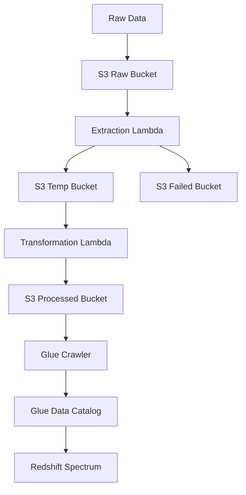

# Building a Scalable Serverless AWS ETL Pipeline with Lambda, S3, and Redshift Spectrum

## Overview

When working on data-driven projects you often need to extract data from third-party sources, public APIs, or CSV files shared by other teams. However, before this data becomes useful, it typically requires cleaning, validation, and transformation before being loaded into a data warehouse for analytics, dashboards, machine learning, or any other use case you might have.

Knowing that, in this post, we’ll walk through the basics of building a simple but effective ETL pipeline using AWS Lambda, Amazon S3, and Redshift Spectrum. This post is not about creating the perfect and most optimized ETL solution but rather about demonstrating how AWS services can be used together to automate data processing in a straightforward way. By the end of this guide, you’ll understand how to trigger a Lambda function to process data and store structured outputs in S3 for further analysis.

## What will we build?

For our example pipeline, we will take a JSON file containing recipe information, validate the data and extract the necessary information, transform the extracted data into clean and query-ready data that will be then stored in an Amazon S3 bucket, where it can be queried using Redshift Spectrum.

## Architecture Diagram



## What will we use and why?

- AWS Lambda: We will use Lambda Functions to do the heavy lifting of extracting, transforming and loading the data. We chose Lambda specially for the serverless nature of the service, this way we don't need to worry about the underlying infrastructure and can focus on the code we want to execute. It also helps us that Lambdas are event-driven, so we can trigger the function from a variety of sources, like S3 events, API Gateway, or even a cron job. This resource is also very cheap to run, adopting a pay-per-use model.

- Amazon S3: We will use S3 to store the raw data, the temporary data, and the processed data. S3 is a very cheap and flexible object storage service that is well integrated with the rest of the AWS ecosystem. S3 also has a feature called S3 Event Notifications, that allows us to trigger a Lambda function when an object is created in a bucket. This is very useful for our use case, as we can trigger the Lambda function whenever a new file is uploaded to the S3 bucket.

- Amazon Redshift Spectrum: We will use Redshift Spectrum to query the data. Redshift Spectrum is a feature of Amazon Redshift that allows you to query data directly from a S3 bucket without having to load the data into a table. Although Redshift Spectrum isn't the fastest service, for our case where we want to store a large amount of data that won't be accessed frequently, it's a good fit. If we ever need to access this data frequently, or if we need to run complex queries, we can always load the data into a table and use a traditional database.

- AWS Glue: Glue is a fully managed ETL service that is well integrated with the rest of the AWS ecosystem. Here we won't use it to it's full extent, instead we will use it to create crawlers that will extract the metadata from the data in the S3 bucket and make it available in the Glue Data Catalog. This will allow us to automatically keep Redshift Spectrum's external tables up to date as we add new files to the S3 bucket. While this might not be necessary if your data is static, I am adding it here as an optional tool for enhanced automation and for learning purposes.

- AWS SAM: SAM is a tool that allows us to define AWS resources in a declarative way. Here we will use it to create the necessary resources for our pipeline.

## Let's get started

### Prerequisites

- AWS Account (I will be using the free tier)
- AWS CLI
- Python 3.x
- AWS SAM CLI

### The template

The SAM template is the main file that defines the resources for our pipeline. It's a YAML file that describes the AWS resources and their properties. To start, we will create the structure of the template.

```yaml
AWSTemplateFormatVersion: "2010-09-09"
Description: ETL Pipeline for Recipe Processing
Transform: AWS::Serverless-2016-10-31

Parameters:
  Environment:
    Type: String
    Default: dev

Resources: ...
```

This is a good starting point, it defines the environment variable that we will use to deploy the template to different environments, but it's still empty. We need to add the resources here for it to be useful.

### Step 1: Create the S3 buckets

We will create 4 buckets:

- `raw-recipes-bucket`: Where we will store the raw data
- `temp-recipes-bucket`: Where we will store the data that is being processed
- `failed-recipes-bucket`: Where we will store the data that failed to be processed
- `processed-recipes-bucket`: Where we will store the processed data

```yaml

---
Resources:
  RawRecipesBucket:
    Type: AWS::S3::Bucket
    Properties:
      BucketName: !Sub "raw-recipes-data-${Environment}"
      AccessControl: Private

  TempRecipesBucket:
    Type: AWS::S3::Bucket
    Properties:
      BucketName: !Sub "temp-recipes-bucket-${Environment}"
      AccessControl: Private

  FailedRecipesBucket:
    Type: AWS::S3::Bucket
    Properties:
      BucketName: !Sub "failed-recipes-bucket-${Environment}"
      AccessControl: Private

  ProcessedRecipesBucket:
    Type: AWS::S3::Bucket
    Properties:
      BucketName: !Sub "processed-recipes-bucket-${Environment}"
      AccessControl: Private
```

Here we define the 4 buckets that we will use in our pipeline. We will use the `!Sub` intrinsic function to dynamically create the bucket names using the `Environment` parameter defined in the `Parameters` section. Also, we set the `AccessControl` property to `Private`, so no one can access the buckets without the proper permissions.

### Step 2: Create the Lambda functions

We will create 2 Lambda functions:

- `extraction-lambda`: Where we will extract the data from the raw data
- `transformation-lambda`: Where we will transform the data

```yaml
...
Resources:
  ... # Our recently created buckets

  DataExtractionLambda:
    Type: AWS::Serverless::Function
    Properties:
      FunctionName: !Sub "extraction-lambda-${Environment}"
      Handler: data_extraction.lambda_handler
      Runtime: python3.12
      CodeUri: lambdas/data_extraction
      Role: !GetAtt LambdaExecutionRole.Arn
      Environment:
        Variables:
          RAW_BUCKET: !Ref RawRecipesBucket
          TEMP_BUCKET: !Ref TempRecipesBucket
          FAILED_BUCKET: !Ref FailedRecipesBucket
      Timeout: 300
      MemorySize: 512
      ReservedConcurrentExecutions: 0
      Events:
        DataExtractionTrigger:
          Type: S3
          Properties:
            Bucket: !Ref RawRecipesBucket
            Events:
              - s3:ObjectCreated:*
              - s3:ObjectRemoved:*

  DataTransformationLambda:
    Type: AWS::Serverless::Function
    Properties:
      FunctionName: !Sub "transformation-lambda-${Environment}"
      Handler: data_transformation.lambda_handler
      Runtime: python3.12
      CodeUri: lambdas/data_transformation
      Role: !GetAtt LambdaExecutionRole.Arn
      Environment:
        Variables:
          TEMP_BUCKET: !Ref TempRecipesBucket
          PROCESSED_BUCKET: !Ref ProcessedRecipesBucket
      Timeout: 300
      MemorySize: 512
      ReservedConcurrentExecutions: 0
      Events:
        DataTransformationTrigger:
          Type: S3
          Properties:
            Bucket: !Ref TempRecipesBucket
            Events:
              - s3:ObjectCreated:*
```

Here we define the 2 Lambda functions that we will use in our pipeline. We will use the `!GetAtt LambdaExecutionRole.Arn` intrinsic function to get the ARN of the Lambda execution role that we will create in the next step.

We are also defining the events that will trigger the Lambda functions. The `DataExtractionTrigger` will trigger the `DataExtractionLambda` when a new object is created in the `RawRecipesBucket`. The `DataTransformationTrigger` will trigger the `DataTransformationLambda` when a new object is created in the `TempRecipesBucket`.

The `CodeUri` property is the path to the Lambda function code in the `lambdas` folder that we will create soon.

### Step 3: Create the Lambda execution role

We need to create a Lambda execution role that will allow the Lambda functions to access the necessary resources.

```yaml
Resources:
  ... # Our recently created Lambda functions

  LambdaExecutionRole:
    Type: AWS::IAM::Role
    Properties:
      AssumeRolePolicyDocument:
        Version: "2012-10-17"
        Statement:
          - Effect: Allow
            Principal:
              Service: lambda.amazonaws.com
            Action: sts:AssumeRole
      Policies:
        - PolicyName: LambdaExecutionPolicy
          PolicyDocument:
            Version: "2012-10-17"
            Statement:
              - Effect: Allow
                Action:
                  - s3:GetObject
                  - s3:PutObject
                  - s3:ListBucket
                  - logs:CreateLogGroup
                  - logs:CreateLogStream
                  - logs:PutLogEvents
                Resource:
                  - !Ref RawRecipesBucket
                  - !Ref TempRecipesBucket
                  - !Ref FailedRecipesBucket
                  - !Ref ProcessedRecipesBucket
```

In this step we are defining the policy that will allow the Lambda functions to access the necessary resources. We are allowing the Lambda functions to get, put, and list objects in the S3 buckets as well as to create log groups and log streams in CloudWatch.
