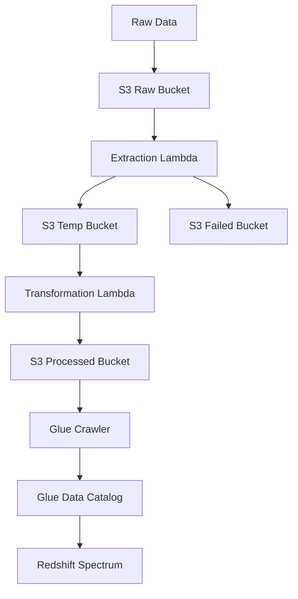

# Recipe Processing Pipeline Architecture

This document describes the architecture of the Recipe Processing Pipeline built using AWS services.

## Overview

The pipeline processes raw recipe data through multiple stages, transforming it into a structured format suitable for analysis. The pipeline consists of the following components:

1. **Data Ingestion**: Raw recipe data is ingested into S3
2. **Data Extraction**: Lambda function processes raw data and validates it
3. **Data Transformation**: Lambda function transforms and enriches the data
4. **Data Storage**: Processed data is stored in S3 with partitioning
5. **Data Cataloging**: Glue Crawler creates/updates the data catalog
6. **Data Analysis**: Redshift Spectrum queries the processed data

## Architecture Diagram



## Components

### 1. S3 Buckets
- **Raw Recipes Bucket**: Stores incoming raw recipe data
- **Temp Recipes Bucket**: Holds validated data awaiting transformation
- **Failed Recipes Bucket**: Stores invalid records
- **Processed Recipes Bucket**: Contains final processed data
- **Lambda Code Bucket**: Stores Lambda function code

### 2. AWS Lambda Functions
- **Data Extraction Lambda**:
  - Validates incoming recipes
  - Splits data into batches
  - Stores valid data in Temp Bucket
  - Stores invalid data in Failed Bucket
  - Sends messages to SQS queue

- **Data Transformation Lambda**:
  - Processes data from Temp Bucket
  - Adds metadata and transformations
  - Stores processed data in Processed Bucket
  - Partitions data by difficulty level

### 3. AWS Glue
- **Glue Crawler**:
  - Runs daily at midnight
  - Crawls Processed Bucket
  - Updates Glue Data Catalog
  - Creates tables with "processed_" prefix

### 4. Amazon Redshift
- **Redshift Spectrum**:
  - Queries data directly from S3
  - Uses external schema and tables
  - Supports complex analysis queries

## Data Flow

1. Raw recipe data is uploaded to Raw Recipes Bucket
2. S3 event triggers Data Extraction Lambda
3. Extraction Lambda validates and processes data:
   - Valid data → Temp Bucket
   - Invalid data → Failed Bucket
4. SQS message triggers Data Transformation Lambda
5. Transformation Lambda processes data:
   - Adds metadata (complexity score, difficulty flag, etc.)
   - Stores processed data in Processed Bucket
6. Glue Crawler updates Data Catalog
7. Redshift Spectrum queries processed data

## Key Features

- **Scalable Processing**: Lambda functions handle varying workloads
- **Data Validation**: Ensures data quality at ingestion
- **Partitioned Storage**: Optimizes query performance
- **Serverless Architecture**: No infrastructure to manage
- **Cost Effective**: Pay only for resources used

## Deployment

The pipeline is deployed using AWS SAM (Serverless Application Model). The deployment process includes:

1. Packaging Lambda code
2. Creating CloudFormation stack
3. Configuring IAM roles and permissions
4. Setting up S3 buckets and SQS queue
5. Configuring Glue Crawler

To deploy:

```bash
sam package --template-file template.yaml --output-template-file packaged.yaml --s3-bucket lambda-code-bucket
sam build
sam deploy --template-file packaged.yaml --stack-name recipe-processing-stack --capabilities CAPABILITY_NAMED_IAM --region us-east-2 --profile recipe-processing-profile
```


## Monitoring

The pipeline includes built-in monitoring through:
- CloudWatch Logs for Lambda functions
- S3 access logs
- Glue Crawler metrics
- Redshift query performance insights

## Future Enhancements

1. Add API Gateway for direct data ingestion
2. Implement data quality metrics
3. Add notification system for failed records
4. Implement data versioning
5. Add data lineage tracking
