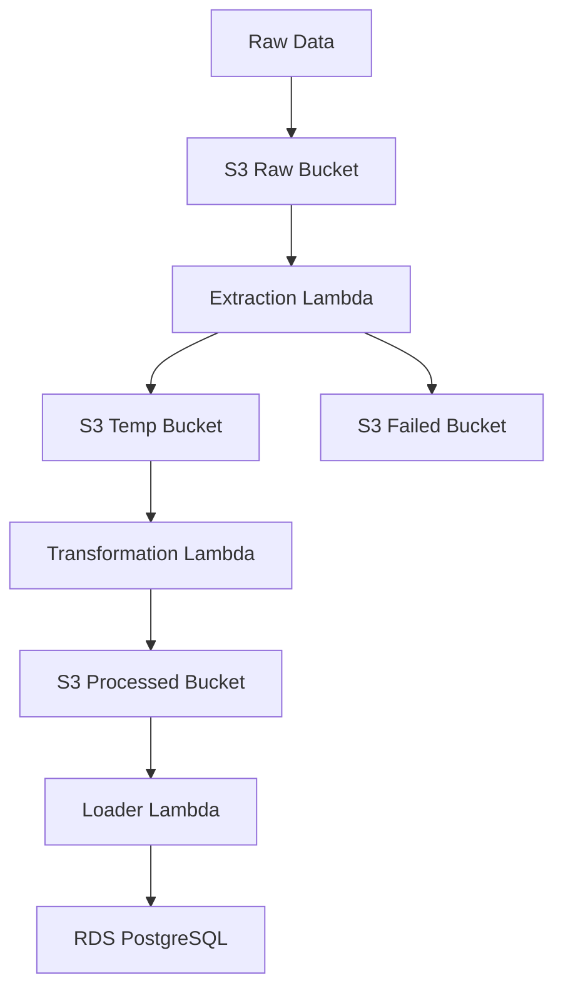

# Recipe Processing Pipeline Architecture

This document describes the architecture of the Recipe Processing Pipeline built using AWS services.

## Overview

The pipeline processes raw recipe data through multiple stages, transforming it into a structured format suitable for analysis. The pipeline consists of the following components:

1. **Data Ingestion**: Raw recipe data is ingested into S3
2. **Data Extraction**: Lambda function processes raw data and validates it
3. **Data Transformation**: Lambda function transforms and enriches the data
4. **Data Loading**: Lambda function loads the data into RDS PostgreSQL
5. **Data Storage**: Processed data is also stored in S3 for backup and further processing

## Architecture Diagram



## Components

### 1. S3 Buckets
- **Raw Recipes Bucket**: Stores incoming raw recipe data
- **Temp Recipes Bucket**: Holds validated data awaiting transformation
- **Failed Recipes Bucket**: Stores invalid records
- **Processed Recipes Bucket**: Contains final processed data

### 2. AWS Lambda Functions
- **Data Extraction Lambda**:
  - Validates incoming recipes
  - Stores valid data in Temp Bucket
  - Stores invalid data in Failed Bucket

- **Data Transformation Lambda**:
  - Processes data from Temp Bucket
  - Adds metadata and transformations
  - Stores processed data in Processed Bucket

- **Data Loader Lambda**:
  - Loads processed data from S3 into RDS PostgreSQL
  - Creates necessary database schema and tables if they don't exist
  - Handles data upserts (inserts/updates) to prevent duplicates

### 3. RDS PostgreSQL
- **PostgreSQL Database**:
  - Stores the processed recipe data in structured tables
  - Supports efficient querying through SQL
  - Provides a reliable database for applications to access the recipe data

## Data Flow

1. Raw recipe data is uploaded to Raw Recipes Bucket
2. S3 event triggers Data Extraction Lambda
3. Extraction Lambda validates and processes data:
   - Valid data → Temp Bucket
   - Invalid data → Failed Bucket
4. S3 event triggers Data Transformation Lambda
5. Transformation Lambda processes data:
   - Adds metadata (complexity score, difficulty flag, etc.)
   - Stores processed data in Processed Bucket
6. S3 event triggers Data Loader Lambda
7. Loader Lambda loads data into RDS PostgreSQL database

## Key Features

- **Scalable Processing**: Lambda functions handle varying workloads
- **Data Validation**: Ensures data quality at ingestion
- **Error Handling**: Failed records are stored separately for analysis
- **Serverless Architecture**: No infrastructure to manage
- **Cost Effective**: Pay only for resources used
- **Reliable Storage**: Data is stored in both S3 and RDS PostgreSQL

## Deployment

The pipeline is deployed using AWS SAM (Serverless Application Model). The deployment process includes:

1. Packaging Lambda code
2. Creating CloudFormation stack
3. Configuring IAM roles and permissions
4. Setting up S3 buckets
5. Configuring Lambda triggers

To deploy:

```bash
sam package --template-file template.yaml --output-template-file packaged.yaml --s3-bucket lambda-code-bucket
sam build
sam deploy --template-file packaged.yaml --stack-name recipe-processing-stack --capabilities CAPABILITY_NAMED_IAM
```

## Monitoring

The pipeline includes built-in monitoring through:
- CloudWatch Logs for Lambda functions
- S3 access logs
- RDS PostgreSQL performance insights and logs

## Future Enhancements

1. Add API Gateway for direct data ingestion
2. Implement data quality metrics
3. Add notification system for failed records
4. Implement data versioning
5. Add data lineage tracking
